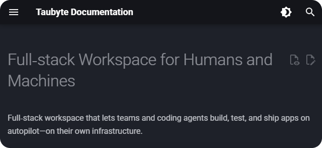

<div align="center">

[](https://github.com/taubyte/tau/releases)
[](LICENSE)

</div>

<div align="center">
  
</div>
</br>

<div align="center">
  <a href="https://taubyte.com/doc"></a>
  <a href="https://discord.gg/KbN3KN7kpQ"></a>
  <a href="https://taubyte.com/book-a-demo"></a>
</div>
</br>

Tau is an open-source, Git-native platform-as-a-service that empowers development teams to build, deploy, and scale applications with full infrastructure autonomy. With built-in AI capabilities, Tau seamlessly integrates intelligent features into your development workflow. Unlike traditional cloud providers, Tau is fully self-hosted while providing the same capabilities as Vercel, Netlify, Cloudflare, and other major platforms—now enhanced with AI-powered development and deployment tools.


### Development Environment

Dream CLI for terminal-based workflows or Dream Desktop for a visual interface. Connect to your cloud using the console .

<div align="center">
  
  
  
</div>

### Build Your Application

Initialize a new project through the console interface and configure your first serverless function. Leverage Tau's AI-assisted development tools to streamline your workflow. Commit and push your changes to automatically trigger the build pipeline, which compiles your WebAssembly function and prepares it for deployment across the distributed network.

<div align="center">
  
  
  
</div>

### Deploy and Run

Monitor build progress through the console's real-time dashboard. Upon successful compilation, execute and validate your function through integrated testing tools. For production infrastructure deployment across your own servers, utilize Spore Drive to orchestrate and manage Tau instances.

<div align="center">
  
  
  
</div>

### Example Projects

<div align="center">
  <a href="https://youtu.be/RIdwJQB3Tk0"></a>
  <a href="https://youtu.be/gMTYh-gQLgA"></a>
</div>

### The Hitchhiker's Guide To Taubyte

A fast paced video series to get you from 0 to hero in ono time.

<div align="center">
  <a href="https://www.youtube.com/watch?v=8FO1KiTE0FE"></a>
  <a href="https://www.youtube.com/watch?v=ajdcUGd2SeE"></a>
  <a href="https://www.youtube.com/watch?v=YyZHCBkjCOU"></a>
</div>

<div align="center">
  <a href="https://www.youtube.com/watch?v=IDUI7a96gSw&t=10s"></a>
  <a href="https://www.youtube.com/playlist?list=PLLKNB3tJrL9Y4nl0JnBhU2wHS4iWldUfh"></a>
</div>

## Support

Questions or need assistance? Join our community on [Discord](https://discord.gg/KbN3KN7kpQ)!

<div align="center">
  <a href="https://taubyte.com/doc"></a>
</div>

## Core Features

| Feature                  | Description                                                                                                                                      |
| ------------------------ | ------------------------------------------------------------------------------------------------------------------------------------------------ |
| **Serverless Functions** | WebAssembly (WASM) runtime supporting Rust, Go, and AssemblyScript. Deploy edge-ready functions with instant cold starts and automatic scaling.  |
| **Static Hosting**       | Deploy websites and single-page applications (SPAs) with automatic routing, custom domains, and edge distribution.                               |
| **Databases**            | Key-value store with encryption, regex matching, local/global options, and configurable size limits. Built for high-performance data operations. |
| **Storage**              | Object storage with versioning and public access controls, plus streaming storage with TTL support. IPFS-backed distributed storage.             |
| **Messaging**            | Real-time pub/sub messaging via MQTT and WebSocket protocols. Enable real-time communication and event-driven architectures.                     |
| **CI/CD Pipeline**       | Git-native workflow with automatic builds on commit/push. Compile and deploy WebAssembly functions seamlessly across your distributed network.   |

### Deploy Your Platform

- **[Spore Drive Boilerplate](https://github.com/taubyte/spore-drive-boilerplate)** - Production-ready deployment template for infrastructure automation

## Deploy to Production

Deploy Tau across your infrastructure using Spore Drive, our deployment automation framework. Install the package to begin orchestrating your distributed platform.

```sh
npm install @taubyte/spore-drive
```

For comprehensive deployment documentation and configuration guides, refer to the [Development Documentation](https://tau.how/development/). Alternatively, use the [Spore Drive Boilerplate](https://github.com/taubyte/spore-drive-boilerplate) repository as a production-ready starting point for your deployment workflow.
