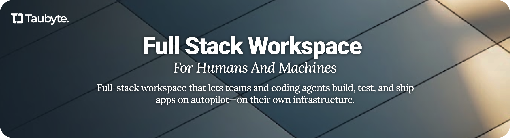
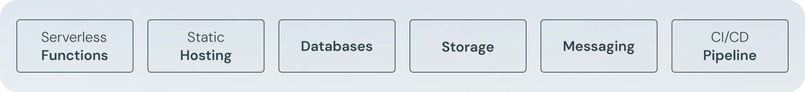
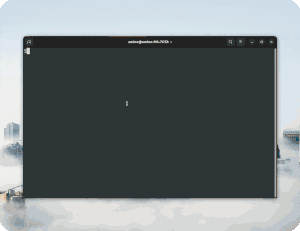
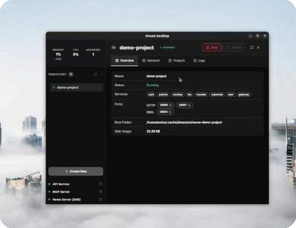
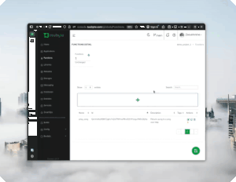
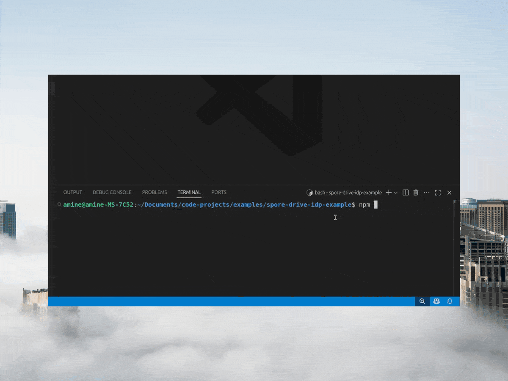

<div align="center">

[](https://github.com/taubyte/tau/releases)
[](LICENSE)

</div>

<div align="center">
  
</div>

## What is Tau?

Tau is an open-source, Git-native platform-as-a-service that empowers development teams to build, deploy, and scale applications with full infrastructure autonomy. Unlike traditional cloud providers, Tau runs entirely on your infrastructure while providing the same capabilities as Vercel, Netlify, Cloudflare, and other major platforms.

<div align="center">
  
</div>

## Quick Start Guide

Get up and running with your first Tau application in minutes. This guide walks you through the complete workflow from local development to production deployment.

### Step 1: Set Up Your Development Environment

Begin by selecting your preferred development interface: Dream CLI for terminal-based workflows or Dream Desktop for a visual interface. Both tools provision a local Tau environment that accurately replicates production infrastructure. Once configured, authenticate with the Taubyte console to access project management capabilities.

<div align="center">
  
  
  
</div>

### Step 2: Create and Build Your Application

Initialize a new project through the console interface and configure your first serverless function. Commit and push your changes to automatically trigger the build pipeline, which compiles your WebAssembly function and prepares it for deployment across the distributed network.

<div align="center">
  
  
  
</div>

### Step 3: Deploy and Run

Monitor build progress through the console's real-time dashboard. Upon successful compilation, execute and validate your function through integrated testing tools. For production infrastructure deployment across your own servers, utilize Spore Drive to orchestrate and manage Tau instances.

<div align="center">
  
  
  
</div>

## Deploy to Production

Deploy Tau across your infrastructure using Spore Drive, our deployment automation framework. Install the package to begin orchestrating your distributed platform.

```sh
npm install @taubyte/spore-drive
```

For comprehensive deployment documentation and configuration guides, refer to the [Development Documentation](https://tau.how/development/). Alternatively, use the [Spore Drive Boilerplate](https://github.com/taubyte/spore-drive-boilerplate) repository as a production-ready starting point for your deployment workflow.

## Learn & Build

### Getting Started

- **[Hitchhiker's Guide to Taubyte](https://www.youtube.com/playlist?list=PLLKNB3tJrL9Y4nl0JnBhU2wHS4iWldUfh)** - Comprehensive video tutorial series covering core concepts and advanced topics
- **[Complete Documentation](https://taubyte.com/doc)** - Full API reference, architecture guides, and best practices

### Example Projects

- **[Pixel Drawing App](https://youtu.be/RIdwJQB3Tk0)** - Step-by-step tutorial for building an interactive canvas application
- **[Tower Blocks Game](https://youtu.be/gMTYh-gQLgA)** - Complete walkthrough for creating a multiplayer game with real-time synchronization

### Deploy Your Platform

- **[Spore Drive Boilerplate](https://github.com/taubyte/spore-drive-boilerplate)** - Production-ready deployment template for infrastructure automation

## Support

Questions or need assistance? Join our community on [Discord](https://discord.gg/KbN3KN7kpQ)!
